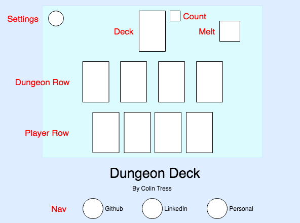

# Dungeon Deck Proposal

### Background

Dungeon Deck is a solo, card-based dungeon crawl game inspired by *Card Crawl* by *Arnold Rauers*. Players must bravely clear all 54 cards in a deck teeming with monsters and treasure without ever falling below 13 health.

### MVP

In Dungeon Deck, players will be able to:
* Read the current game state (health, score, etc.)
* Click on and assign targets to cards
* Restart game or view instructions via settings button

Additionally, this project will include a production README.

### Wireframe

Users can interact with the game by selecting a single card from either the **Dungeon** or **Player** rows, and then selecting a valid target for that card, such as a monster or the melting fire. Players can also click on **Settings** at any time to exit or restart the game.

### Technologies & Architecture

This game will be built using the following Technologies:
* `JavaScript` for game logic
* `HTML` & `Canvas` for visual display
* `Webpack` for bundling JS files

Following OOP principles, this game will contain the following scripts:
* `card.js` describes the properties of cards
* `deck.js` is responsible for populating a shuffled deck
* `board.js` is responsible for rules enforcement and game flow
* `player.js` describes how players interact with the game
* `game.js` implements the play cycle and checks for endgame

### Timeline

**D01**: Create project skeleton, and setup all Node modules. Define an `HTML` entry file. Review basics of `Canvas` and render an object to the entry file.

**D02**: Focus on the game logic, getting at least the Card, Deck, and Board classes finished sans graphical implementation.

**D03**: Focus on player interactivity, integrating `Canvas` with the JS classes. Finish classes, and bare minimum graphical interface.

**D04**: Finalize any game logic and player interaction. Add images to `Canvas` and polish.
